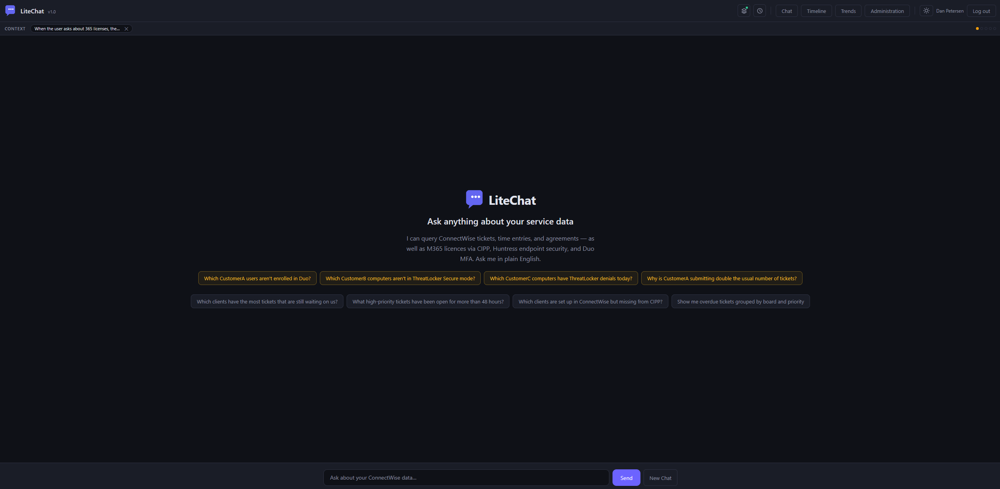
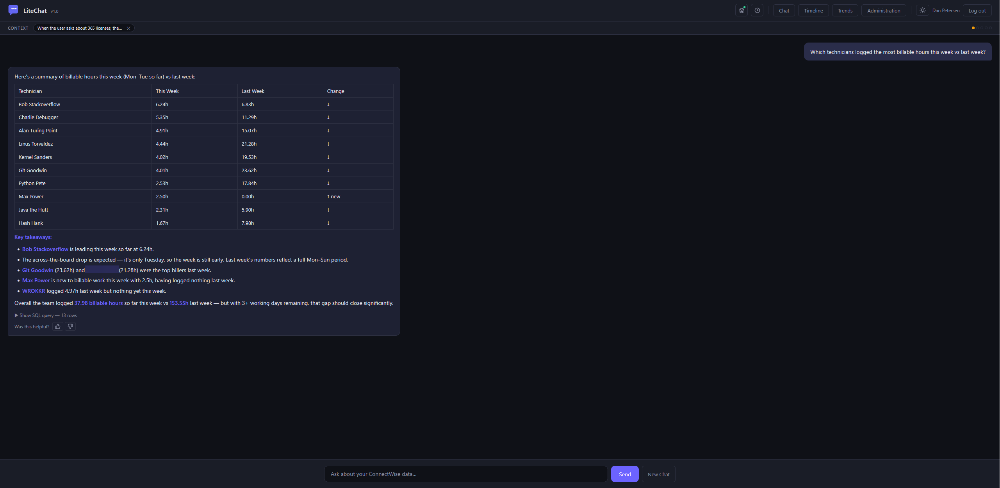
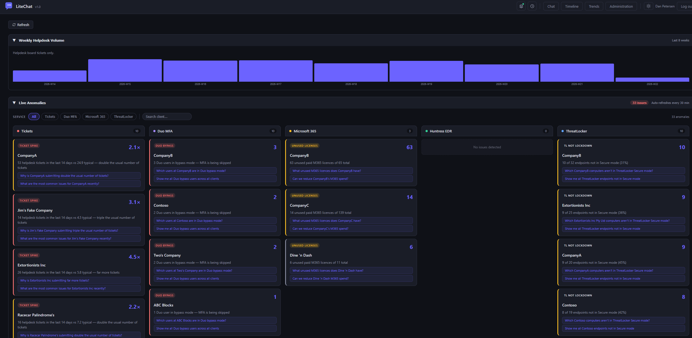
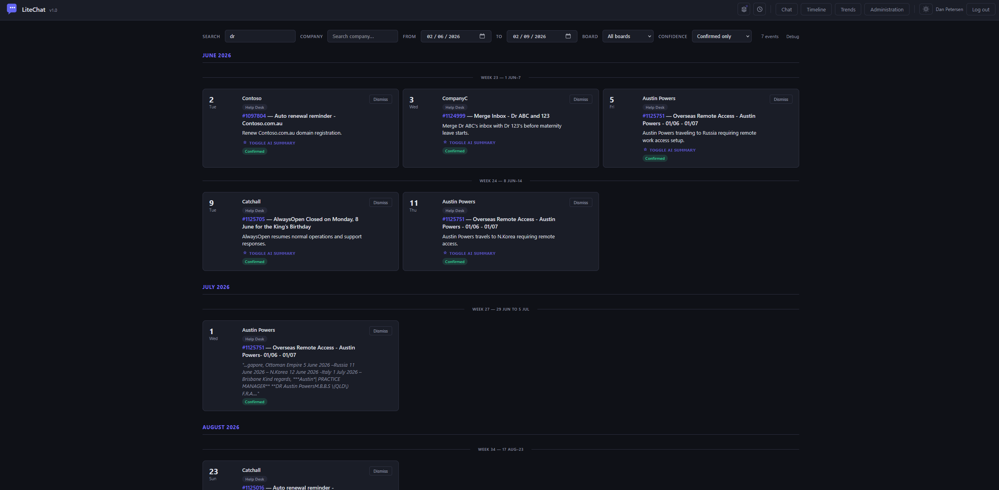

# ChatPSA

A conversational AI interface for MSPs to query ConnectWise Manage data using natural language — with optional integrations for Microsoft 365, Duo Security, Huntress, and ThreatLocker.

Ask questions in plain English, get answers backed by real SQL against a local read-only mirror of your data.



## Features

### Natural-Language Queries

Ask questions like *"which clients logged the most tickets this month?"* or *"who logged the most hours this week?"* and get instant answers. ChatPSA translates your questions into SQL, runs them against a local SQLite mirror of your ConnectWise data, and returns formatted results — tables, lists, or summaries depending on what you asked.



### Trend and Anomaly Detection

Automatically surfaces operational issues across all connected services:

- **Ticket spikes** — clients with unusual ticket volume compared to their baseline
- **Overdue tickets** — high-priority tickets past their SLA
- **Quiet clients** — managed clients with no recent activity (potential churn risk)
- **Unused M365 licences** — paid licences with no assigned user (via CIPP)
- **Duo MFA bypass** — users with MFA in bypass mode
- **Huntress incidents** — open EDR incidents by severity
- **ThreatLocker alerts** — unsecured endpoints and deny spikes



### Timeline

Extracts future-dated events from ticket notes — scheduled maintenance, follow-ups, renewals — and plots them on a visual timeline. Optionally generates AI summaries for each event.



### Pinned Queries

Save frequently-used queries as live dashboard cards. Each pin re-runs its SQL on every page load, giving you an at-a-glance overview without retyping anything.

### Agent Memories

The AI remembers context across sessions — your preferences, naming conventions, common filters. Memories are per-user and manageable from the UI.

### Multi-Service Data Sync

Pulls data from up to six sources into a single local database:

| Source | Data | Required? |
|--------|------|-----------|
| ConnectWise Manage | Tickets, time entries, agreements, companies, contacts, configurations, projects, invoices | Yes |
| CIPP / Microsoft 365 | Tenants, licences, alerts, security policies | Optional |
| Duo Security | MFA user enrolment and status across child accounts | Optional |
| Huntress | Organizations, agents, incident reports | Optional |
| ThreatLocker | Endpoint inventory, security mode, deny counts | Optional |

### Administration

- **Live settings** — change app name, timezone, AI model, and integration credentials from the web UI without redeploying
- **Feature-based access control** — grant admin, timeline, and analytics access per user
- **Sync status dashboard** — monitor each data source's last sync time and row counts
- **Customer mapping** — link companies across ConnectWise, M365, Duo, Huntress, and ThreatLocker with fuzzy matching

### Security

- API keys never leave the server — all external calls happen server-side
- SQL runs against a **read-only local mirror**, not your production ConnectWise database
- Only `SELECT` queries are permitted — the AI agent cannot modify any data
- CSRF protection on all API endpoints
- Optional SSO via Microsoft Entra ID (Azure AD)
- HSTS, CSP, and secure cookie headers when running behind HTTPS

For a deeper look at each feature — how it works, limits, and configuration — see the [Features Guide](docs/features.md). For admin panel documentation, see the [Administration Guide](docs/administration.md).

---

## Quick Start

**Prerequisites:** [Docker](https://docs.docker.com/engine/install/),  [Docker Compose](https://docs.docker.com/compose/install/) (v2), a [Claude API Key](https://console.anthropic.com) and [Connectwise PSA API credentials](docs/integrations/connectwise.md).

```bash
git clone https://github.com/HealthITAU/ChatPSA.git
cd ChatPSA
cp .env.example .env
```

Edit `.env` with your API keys (at minimum, `ANTHROPIC_API_KEY` and the five `CW_*` variables):

```bash
nano .env
```

Start the containers:

```bash
docker compose up -d
```

Open `http://localhost:5001`. The first sync takes some time — you'll see a pulsing indicator until data is available.

> **Local-only mode:** By default, Docker binds the app to `127.0.0.1:5001`. No DNS, no WAN exposure — just open `localhost:5001` in your browser. For remote access, see [Reverse Proxy Setup](docs/reverse-proxy.md).

---

## Configuration

Environment variables in `.env` seed the database on first boot. After that, most settings can be changed live via **Admin → Settings** without redeploying.

Set `ENV_OVERRIDE=true` to force all settings to read from env vars instead of the database.

### Required

| Variable | Description |
|----------|-------------|
| `ANTHROPIC_API_KEY` | [Anthropic API key](https://console.anthropic.com/) |
| `CW_SITE` | ConnectWise API domain (e.g. `api-na.myconnectwise.net`) |
| `CW_COMPANY_ID` | Your ConnectWise company identifier |
| `CW_PUBLIC_KEY` | ConnectWise API public key |
| `CW_PRIVATE_KEY` | ConnectWise API private key |
| `CW_CLIENT_ID` | ConnectWise developer client ID (GUID) |

### Application

| Variable | Default | Description |
|----------|---------|-------------|
| `APP_NAME` | `ChatPSA` | Display name in the UI and AI system prompt |
| `APP_PORT` | `5001` | Host port Docker maps to the container |
| `APP_TZ_NAME` | `Australia/Brisbane` | IANA timezone name (handles DST automatically) |
| `HELPDESK_BOARD` | `Help Desk` | Primary ConnectWise board name |
| `CLAUDE_MODEL` | `claude-sonnet-4-6` | Anthropic model (`claude-sonnet-4-6` or `claude-haiku-4-5`) |
| `CLAUDE_MAX_TOKENS` | `4096` | Max tokens per AI response (100–32000) |
| `TRENDS_EXCLUDE_COMPANIES` | | Companies to exclude from anomaly detection |
| `FLASK_SECRET_KEY` | Auto-generated | Session cookie secret (auto-persisted if unset) |

### Optional Integrations

Each integration is enabled by setting its credentials. See the individual setup guides for details.

| Integration | Variables | Guide |
|-------------|-----------|-------|
| Microsoft Entra ID (SSO) | `AZURE_CLIENT_ID`, `AZURE_CLIENT_SECRET`, `AZURE_TENANT_ID` | [Authentication](docs/authentication.md) |
| CIPP / Microsoft 365 | `CIPP_API_URL`, `CIPP_CLIENT_ID`, `CIPP_CLIENT_SECRET` | [CIPP Setup](docs/integrations/cipp.md) |
| Duo Security | `DUO_IKEY`, `DUO_SKEY`, `DUO_HOST` | [Duo Setup](docs/integrations/duo.md) |
| Huntress | `HUNTRESS_API_KEY`, `HUNTRESS_API_SECRET` | [Huntress Setup](docs/integrations/huntress.md) |
| ThreatLocker | `THREATLOCKER_API_KEY` | [ThreatLocker Setup](docs/integrations/threatlocker.md) |

---

## Deployment

ChatPSA runs entirely in Docker. The included `docker-compose.yml` starts the web app and all sync containers.

For production deployment with HTTPS, SSO, and a reverse proxy, see:

- [Full Deployment Guide](DEPLOY.md) — step-by-step Ubuntu + Apache setup
- [Reverse Proxy Setup](docs/reverse-proxy.md) — Nginx, Apache, and Caddy examples
- [Authentication](docs/authentication.md) — Microsoft Entra ID SSO configuration
- [Troubleshooting](docs/troubleshooting.md) — common issues and fixes
- [Timezone Configuration](docs/timezone.md) — IANA timezone names and DST handling

### Docker Services

| Container | Purpose | Schedule |
|-----------|---------|----------|
| `psa-app` | Web application (Flask/Gunicorn) | Always running |
| `psa-sync` | ConnectWise data sync | Every 60 min, business hours |
| `psa-cipp-sync` | CIPP / M365 sync | Every 4 hours, business hours |
| `psa-duo-sync` | Duo Security sync | Every 6 hours |
| `psa-threatlocker-sync` | ThreatLocker sync | Every 6 hours |
| `psa-huntress-sync` | Huntress EDR sync | Every 6 hours |
| `psa-timeline-parse` | Timeline event extraction | Every 2 hours |

Optional sync containers (CIPP, Duo, ThreatLocker, Huntress) start automatically but wait for credentials — configure them via Admin → Settings or `.env` and the sync begins within 30 seconds.

### Updating

```bash
git pull
docker compose build --no-cache
docker compose down && docker compose up -d
```

---

## Integration Setup Guides

- [ConnectWise Manage](docs/integrations/connectwise.md) — API member creation and permissions
- [CIPP / Microsoft 365](docs/integrations/cipp.md) — OAuth2 credentials from your CIPP instance
- [Duo Security](docs/integrations/duo.md) — MSP Accounts API setup
- [Huntress](docs/integrations/huntress.md) — API key generation
- [ThreatLocker](docs/integrations/threatlocker.md) — Portal API key

---

## Example Questions

Once your data is synced, try asking:

- *"How many tickets were opened this week?"*
- *"Which clients have had no tickets in the last 30 days?"*
- *"Show me all overdue tickets on the service board"*
- *"What are the top 10 busiest clients this month?"*
- *"Who logged the most hours this week?"*
- *"Are there any ticket spikes compared to last week?"*
- *"Which M365 licences are unassigned?"*
- *"List all Duo users in bypass mode"*

---

## Contributing

Contributions are welcome — bug fixes, new integrations, UI improvements. Feel free to open an issue or submit a pull request.

1. Fork the repository
2. Create a feature branch (`git checkout -b feature/my-feature`)
3. Commit your changes
4. Push to your fork and open a pull request

---

## Licence

[GNU Affero General Public License v3.0](LICENSE) — free to use, modify, and self-host. If you run a modified version as a hosted service, you must publish your changes under the same licence.
